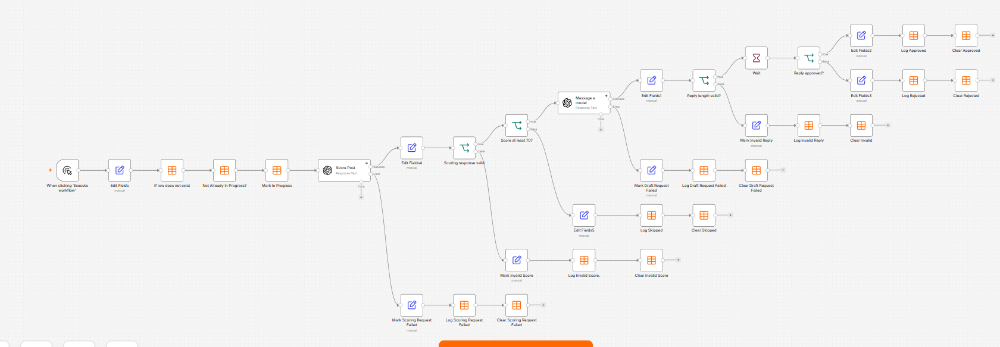
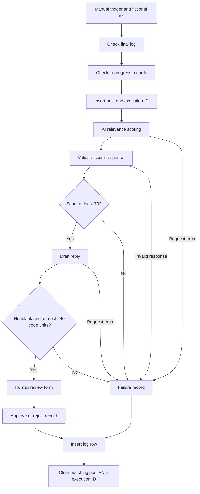

# AI Engagement Review — Portfolio Demo

## Demo results

| Test | Score | Outcome |
|---|---:|---|
| Relevant post — approved | 85 | Approved; publishing disconnected |
| Relevant post — rejected | 85 | Rejected; not published |
| Unrelated post | 10 | Skipped; no approval requested |

Tests used fictional posts. This demo does not monitor or publish to X.

A manually triggered n8n prototype that evaluates a fictional technology post, drafts a reply, requests human approval, and records the outcome. It demonstrates workflow orchestration, structured-response validation, human review, logging, and error handling.

**Status: demonstration only. No live X monitoring or publishing. Run one post and one execution at a time.**

## Package

- `AI-Engagement-Portfolio-Demo.json`: inactive workflow template, 35 nodes. Account credentials, table bindings, project links, instance metadata, execution/pinned data, and original workflow identifiers have been removed. Node and webhook identifiers were regenerated. The supplied workflow was not edited.
- This guide: configuration, demonstration, limitations, and a portfolio description.

## Setup

1. Import the JSON as a NEW workflow. Do not replace your working workflow.
2. Create two fresh n8n data tables in a demo workspace. The export does not create tables or include their rows.
3. Create `Portfolio_Engagement_Log` with the columns below. Keep n8n's automatic id/createdAt/updatedAt fields.

| Column | Type |
|---|---|
| post_id | String |
| post_text | String |
| draft_reply | String |
| decision | String |
| approval_status | String |
| publishing_status | String |
| submittedAt | String |
| score | Number |
| reason | String |

4. Create `Portfolio_Engagement_InProgress` with `post_id` and `execution_id`, both String.
5. In **If row does not exist** and all seven **Log** nodes, select the new Log table. In **Not Already In Progress?**, **Mark In Progress**, and all seven **Clear** nodes, select InProgress. The table selectors are deliberately empty in the shared template. Reselect `post_id` and `execution_id` filter columns if the importer requests it; preserve their expressions and equality conditions.
6. Configure your own OpenAI credential on **Score Post** and **Message a model**. Both are set to `gpt-4.1-mini`; access and billing depend on your API account. No credentials are bundled.
7. Preserve existing node names: expressions reference Edit Fields, Edit Fields1, and Edit Fields4 by name. Do not enable Always Output Data on duplicate checks.
8. Review validation warnings before running. Keep the workflow manual and inactive. The form can be reached during a manual test; do not share its signed URL.

## Architecture

The original graph has separate logging and cleanup nodes for each outcome; the diagram combines them for readability. A missing logged/in-progress match passes the item; an existing match stops that path.

## Demonstration

Use fictional posts only and a fresh `post_id` per case. The initial sample is `portfolio_001` and asks about AI handling repetitive tasks.

1. Run the AI sample, choose Approve in the form, and inspect the log: `approved` and `not_connected`. Approval does not publish.
2. Give the same sample a new ID, run, and choose Reject: `rejected` and `not_published`.
3. Give an ice-cream question a new ID: expect a low relevance score, `skipped_low_score`, and no review form. AI scores are estimates, not deterministic probabilities.
4. Repeat an already logged ID: processing stops before scoring.
5. During an unanswered form, inspect InProgress for the post and current execution ID. After submission, inspect the final log and confirm cleanup.

Capture only cropped workflow and fictional-output screenshots. Hide account headers, browser addresses, credentials, table URLs, and signed form links. Do not use screenshots from any sensitive personal deployment.

## Validation evidence and limits

During development, manual runs demonstrated approved/rejected/low-score paths; sequential duplicate blocking; pending-entry blocking; owner-matched cleanup; canceled-run manual recovery; malformed score JSON; blank and overlong drafts; and scoring/drafting request-error paths. These are observations from the development session, not a claim of a production test suite or measured reliability rate.

This packaged copy was checked for valid JSON, valid graph endpoints, removal of known account/table references, restored model IDs, and absence of temporary test nodes. On September 14, 2026, the user reported completing approval, rejection, and low-score tests after import and configuration with new portfolio tables. The approval screenshot showed approved/not_connected. The final export was inspected: all 35 nodes remain, all seven logging nodes use the portfolio log, all seven cleanup nodes match both post_id and execution_id, and both AI nodes retain their error branches. This is user-reported runtime evidence plus static export review, not an independently executed test suite or verification of a separate workspace. The shared template removes account bindings again and restores the fictional AI sample; recipients must configure credentials and tables before running.

## Important limitations

- No X API reading, monitoring, scheduling, posting, rate-limit handling, or platform approval is implemented. There is no external publishing node.
- Checking and inserting an in-progress row are separate operations. Two simultaneous runs can both pass. This is NOT a distributed lock. An atomic database claim with uniqueness enforcement is required before concurrent unattended operation.
- Every final log row currently blocks the same post ID on future runs, including transient AI failures. Clearing InProgress alone does not make a failed post retryable. Production needs separate attempt history and explicit retry/terminal-state rules.
- Log insertion and cleanup are separate writes. A failed log write leaves the claim; failed cleanup can leave an already logged post in progress. Manual intervention remains necessary for some failures.
- Cleanup matches post ID AND execution ID. Do not remove a claim merely because it is old. First inspect the owning execution and distinguish Waiting/Running from Canceled/Error. A canceled unlogged test can be restarted after removing only its matching claim.
- The approval form has no separately configured reviewer authentication in this export. Possession of its signed link may grant submission access. It is not ready as the authorization boundary for a sensitive live account.
- The length check uses JavaScript string length (UTF-16 code units), not X's weighted character rules. It is suitable for this English-text demo, not proof of X posting compatibility.
- Prompts and JSON checks reduce some errors but do not guarantee factual accuracy, privacy, or resistance to malicious post instructions. Human review is essential.
- API errors are recorded as handled workflow outcomes. A successful execution can contain `scoring_request_failed` or `draft_request_failed`; monitor those statuses, not only execution success.
- The draft-error path records a failure explanation in `reason`, replacing the earlier relevance explanation. Separate fields would improve a production audit log.
- The input is one fictional post. Batch processing, independent approval for multiple items, retention limits, identity separation, and deployment security are outside this demo.

## Suggested portfolio description

Built an n8n prototype that scores technology posts with an LLM, validates generated responses, routes reply drafts through human approval, and records outcomes in data tables. Added sequential duplicate checks, execution-specific cleanup, and tested failure branches for malformed responses and failed AI requests. The demo uses synthetic inputs and does not connect to or publish on X.

## Next engineering work

Before live use: choose the identity-separated environment; implement atomic claims and safe retry semantics; secure reviewer access; address database-write failures and operational alerting; then assess X access, rules, costs, and posting safeguards. Keep any sensitive account entirely out of the public portfolio.

